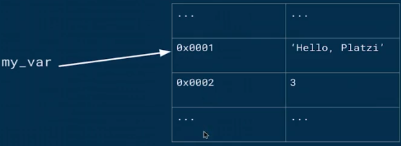

CURSOS ESCUELA DE CIENCIA DE DATOS PLATZI

Indice.

- [Introducción al pensamiento computacional con python](#introducción-al-pensamiento-computacional-con-python)
- [Introducción a python](#introducción-a-python)
  - [Elementos Basicos.](#elementos-basicos)
  - [Asignación de variables.](#asignación-de-variables)
  - [Operadores de Comparación.](#operadores-de-comparación)
  - [Operadores Logicos.](#operadores-logicos)
___
# Introducción al pensamiento computacional con python
# Introducción a python
___
## Elementos Basicos.
- ***Que es un lenguaje de programación:*** Es un lenguaje formal que utiliza un conjunto de ordenes (instrucciones) en forma ordenada y generadas por una persona (programador), para crear programas que se envian a un sistema computacional para controlar el comportamiento fisico y logico de la maquina.
- ***Tipos de lengiajes de programación:*** Existen lenguajes de bajo nivel y alto nivel.
  - ***Bajo Nivel :*** Son lenguajes orientados a la maquina con una orientación entre hardware y maquina.
  - ***Bajo Nivel :*** Son lenguajes orientados a la persona ya que su estructura y usabilidad es mas simple.
  - ***Especifico de Dominio DSL:*** Es un lenguaje dedicado a resolver, representar un problema en particular.
  - ***Proposito General:*** Es un lenguaje que sirve para resolver todo tipo de problemas.
  - ***Compilados:*** Es un lenguaje que requiere de un paso adicional este paso es la compilzación que convierte el codigo estro en lenguaje de maquina.
  - - ***Interpretados:*** Es un lenguaje que convierte el codigo a codigo de maquina en la medida que se va generando.
- ***Que es un Objeto:*** Es un concepto de abstracción, cosa que tiene limites bien definidos.
    - ***Objetos escalares:*** Son datos que se pueden subdividir en piezas de tipo enteros, flotantes, etc.
    - ***Objetos No escalares:*** Son lo contrario de los escalares, datos que no se pueden sub dividir.
___
## Asignación de variables.
- La forma correcta de asignar variables es darles un nombre correcto a cada variable.
  - Definción Incorrecta. 
        
 

  - Definición Correcta.
        
 
        
        

  - Reaccinación de variable: Es cuando se le asigna un nuevo valor a una variable, esto apunta a un lugar en la memoria del equipo liberando el antiguo espacio para que el Garbage Collector (GC) limpie el espacio.
    - Asignación variable A.
        
 

    - Asignación variable B.
        
 

___
## Operadores de Comparación.
- Operador de igualdad. `==`
- Operador de desigualdad. `!=`
- Operador Mayor que. `>`
- Operador Menor que. `<`
- Operador Mayor igual que. `>=`
- Operador Menor igual que. `<=`
## Operadores Logicos. 
- Operador `AND`.
- Operador `OR`
- Operador `NOT`

 

