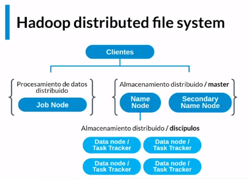

INDICE.
- [Hadoop.](#hadoop)
  - [Configuración Hadoop.](#configuración-hadoop)
  - [Tipos de  compresion.](#tipos-de--compresion)
  - [Comandos Hadoop.](#comandos-hadoop)
- [Yarn.](#yarn)
- [Recursos.](#recursos)
- [Author.](#author)
- [Fuentes.](#fuentes)
___
 # Hadoop.
 - HDFS = Sistema de archivos distribuidos.
  
 

 
 - Job Node => Es el job que se encarga de realizar todas las tareas y/o trabajos.
 - Name Node => Es el registro donde esta la ubicacion de los datos.
 - Data Node => Es donde se encuentran registrado los datos.
____
 ## Configuración Hadoop.
 1. Clonar repositorio => git clone https://github.com/terranigmark/curso-hadoop-platzi.git
 2. Crear una red sudo docker network create --driver=bridge hadoop
 3. Inicializar contenedores con archivo start-container.sh => sudo ./start-container.sh
 4. Levantar servicio hadoop.
   - Ingresar al contenedor master. => docker exec -it {id} /bin/bash
   - Ejecutar => ./start-hadoop.sh
____
 ## Tipos de  compresion.
 - Parquet formato.
 - Avro formato.
____
 ## Comandos Hadoop.
 - hdfs dfs -p {carpeta} => Crer carpetas
 - hdfs dfs -ls => Consultar directorio
 - hdfs dfs -put {archivo} {carpeta/} => Trasladar archivos
____
 # Yarn.

 

 - Manejador y negoiador de recursos.
 - Su objeto es negoiar los reursos con las diferentes herramientas.
____
 # Recursos.
 - The Project Gutenberg EBook of La Odisea, by Homer https://www.gutenberg.org/files/58221/58221-0.txt
 - repositorio => https://github.com/terranigmark/curso-hadoop-platzi.git
_____
 # Author.
 - Oscar Giovanni Bocanegra
 - https://www.linkedin.com/in/oscarbocanegra/
____
 # Fuentes.
 - Cursos de Platzi [Platzi](http://platzi.com/)
  - Cursos de [OpenWebinars](https://openwebinars.net/)
___