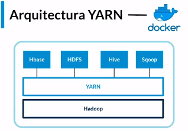

INDICE.
- [Hadoop.](#hadoop)
  - [Configuración Hadoop.](#configuración-hadoop)
  - [Tipos de  compresion.](#tipos-de--compresion)
  - [Comandos Hadoop.](#comandos-hadoop)
- [Yarn.](#yarn)
- [Recursos.](#recursos)
- [Author.](#author)
- [Fuentes.](#fuentes)
___
# Hadoop.
  - HDFS = Sistema de archivos distribuidos.
  - Job Node => Es el job que se encarga de realizar los trabajos.
  - Name Node => Es el registro donde esta la ubicacion de los datos.
  - Data Node => Es donde se encuentran registrado los datos.
___
## Configuración Hadoop.

  1. Clonar repositorio => git clone https://github.com/terranigmark/curso-hadoop-platzi.git
  2. Crear una red sudo docker network create --driver=bridge hadoop
  3. Inicializar contenedores con archivo start-container.sh => sudo ./start-container.sh
  4. Levantar servicio hadoop.
     - Ingresar al contenedor master. => docker exec -it {id} /bin/bash
     - ejecutar => ./start-hadoop.sh
___
## Tipos de  compresion.
  - Parquet formato.
  - Avro formato.
___
## Comandos Hadoop.
  - Crer carpetas => hdfs dfs -p {carpeta}
  - Consultar directorio => hdfs dfs -ls
  - Trasladar archivos => hdfs dfs -put {archivo} {carpeta/}
___
# Yarn.

 

  - Manejador y negoiador de recursos.
  - Su objeto es negoiar los reursos con las diferentes herramientas.
___
# Recursos.
- The Project Gutenberg EBook of La Odisea, by Homer https://www.gutenberg.org/files/58221/58221-0.txt
- repositorio => https://github.com/terranigmark/curso-hadoop-platzi.git
____
# Author.
  - Oscar Giovanni Bocanegra
  - https://www.linkedin.com/in/oscarbocanegra/
___
# Fuentes.
  - Cursos de Platzi [Platzi](http://platzi.com/)
  - Cursos de [OpenWebinars](https://openwebinars.net/)
___